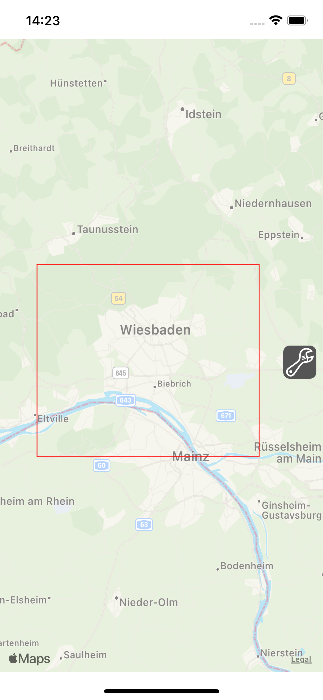
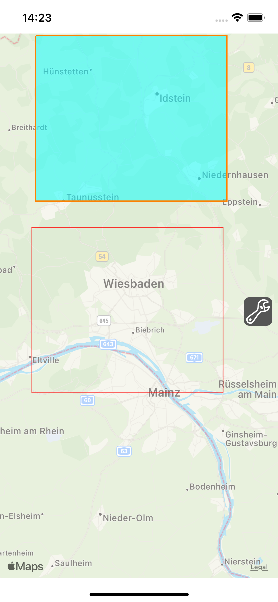
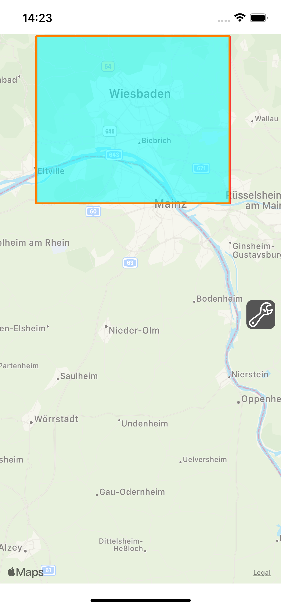

# MKMultiPoint to UIView

A simple Swift demo project how to convert a route on a map to a path which will be added as a layer on a new `UIView`.
The map is a standard `MKMapView` map with a standard `MKPolyline` overlay added.

The needed extensions are based on `MKMultiPoint` which `MKPolyline` subclasses from.

The added function **calculatePath** on `MKMultiPoint` does the main convertion from `CLLocationCoordinate2D` to `CGPoint` and returns the path as a `UIBezierPath`.

# MainVC.swift

The `MainVC` is a simple `UIViewController` which embeds a `MKMapView`. It also adds a rectangle overlay and a button to create a view with the path from the rectangle. See the following screenshot of it:

After clicking the wrench button, the view with the path will be created

Moving the underlaying map a little around to match the postion:

